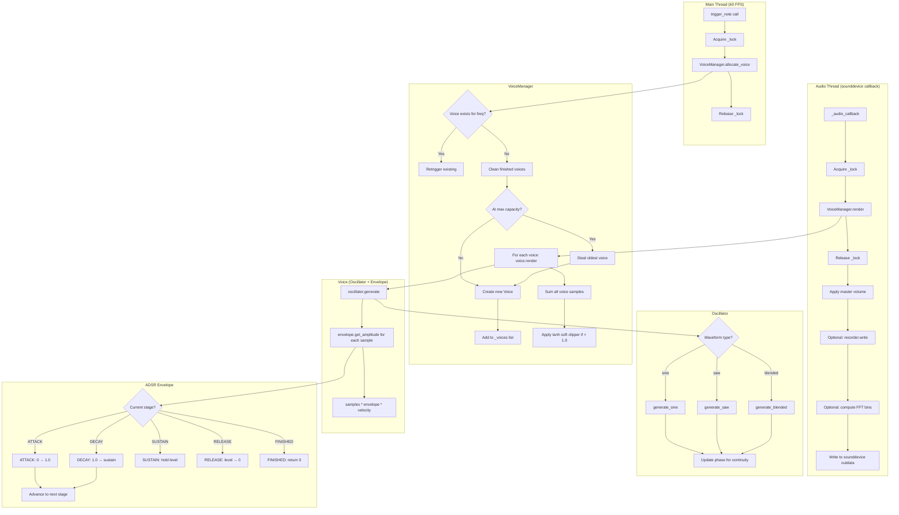
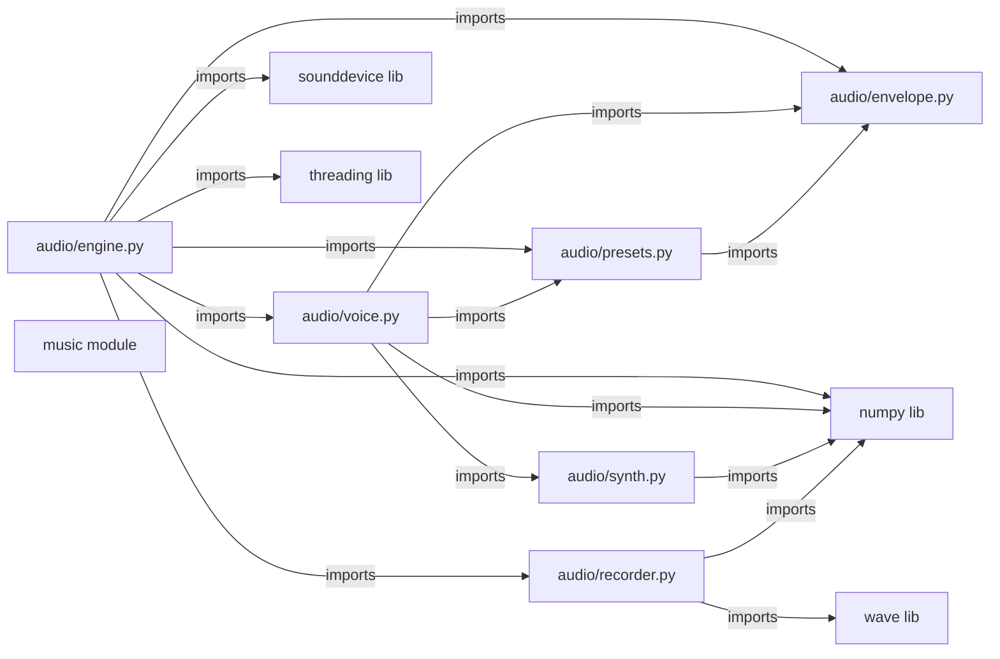

# Module: audio

## Status and Ownership

**Status: complete**

**Owns:** `src/omnichord/audio/`

## Responsibilities

- Real-time audio output via sounddevice callback
- Thread-safe voice triggering from main thread
- 16-voice polyphonic management with voice stealing
- ADSR envelope generation (Attack, Decay, Sustain, Release)
- Waveform synthesis (sine, sawtooth, blended)
- Sound profile presets (warm-pad, plucky-bass, harp, etc.)
- Optional circular buffer recording for debugging
- Optional FFT spectrum analysis for visualization

## Public Interfaces

### AudioEngine
- **`AudioEngine(sample_rate=44100, buffer_size=512, max_voices=16)`** - Constructor
- **`start()`** - Start sounddevice stream
- **`stop()`** - Stop and close stream
- **`trigger_note(freq, velocity=1.0, profile=None)`** - Thread-safe note trigger
- **`release_note(freq)`** - Release specific frequency
- **`release_all()`** - Release all active voices
- **`set_volume(volume)`** - Master volume 0.0-1.0
- **`enable_fft(enabled)`** - Enable/disable FFT spectrum
- **`set_recorder(recorder)`** - Attach CircularRecorder
- **`active_voice_count`** property - Number of active voices
- **`last_peak`** property - Peak amplitude for metering
- **`fft_bins`** property - 32-bin FFT spectrum (0.0-1.0)

### SoundProfile (from presets)
- **`SoundProfile(adsr, waveform, sine_mix)`** - Dataclass with ADSR params, waveform type, sine mix
- **`get_bass_preset(name)`** - Load bass preset: "warm-pad", "plucky-bass", "classic"
- **`get_strum_preset(name)`** - Load strum preset: "harp", "bright", "classic"

### ADSRParams
- **`ADSRParams(attack, decay, sustain, release)`** - ADSR times (seconds) + sustain level

### ADSREnvelope
- **`ADSREnvelope(params, sample_rate)`** - Constructor
- **`trigger()`** - Start envelope (note on)
- **`release()`** - Release envelope (note off)
- **`get_amplitude()`** - Get current level and advance by one sample
- **`is_finished()`** - Check if envelope complete

### Oscillator
- **`Oscillator(freq, sample_rate, waveform="blended", sine_mix=0.7)`** - Constructor
- **`generate(num_samples)`** - Generate waveform samples

### CircularRecorder
- **`CircularRecorder(duration_seconds, sample_rate)`** - Constructor
- **`write(samples)`** - Append samples to buffer
- **`save()`** - Save buffer to timestamped WAV file

## Internal Architecture

## Dependencies

## Key Flows

### Voice Allocation (with Stealing)
1. **Check existing** - Search `_voices` for matching frequency (±0.01 Hz)
2. **Retrigger if found** - Update velocity, call `voice.trigger()`
3. **Clean finished** - Remove voices where `is_finished()` returns True
4. **Check capacity** - If `len(_voices) >= max_voices`, steal oldest
5. **Create voice** - New Oscillator + ADSREnvelope from profile
6. **Trigger** - Call `voice.trigger()`, set `start_time`
7. **Append** - Add to `_voices` list

**Evidence:** `audio/voice.py:91-146`

### Audio Callback Rendering
1. **Acquire lock** - `with self._lock:`
2. **Render voices** - `VoiceManager.render(frames)` returns mixed samples
3. **Release lock**
4. **Apply master volume** - `samples * self._master_volume`
5. **Write to outdata** - `outdata[:, 0] = final_samples`
6. **Update peak** - `np.max(np.abs(final_samples))`
7. **Write to recorder** - If enabled, `recorder.write(final_samples)`
8. **Compute FFT** - If enabled, bin into 32 frequency bands

**Evidence:** `audio/engine.py:162-206`

### ADSR Envelope State Machine
**States:** IDLE → ATTACK → DECAY → SUSTAIN → RELEASE → FINISHED

**ATTACK:**
- Ramp level from 0 to 1.0 over `attack_samples`
- Advance when `_stage_position >= attack_samples`

**DECAY:**
- Ramp level from 1.0 to `sustain` level over `decay_samples`
- Advance when `_stage_position >= decay_samples`

**SUSTAIN:**
- Hold at `sustain` level indefinitely
- Only advance on explicit `release()` call

**RELEASE:**
- Ramp level from current level to 0 over `release_samples`
- Advance to FINISHED when `_stage_position >= release_samples`

**Evidence:** `audio/envelope.py:90-142`

### Waveform Generation with Phase Continuity
1. **Calculate phase increment** - `2π * freq / sample_rate`
2. **Generate phases** - `phase + arange(num_samples) * increment`
3. **Apply waveform function** - `sin(phases)` or `normalized_saw(phases)`
4. **Update internal phase** - `(phase + num_samples * increment) % 2π`
5. **Return samples + new phase** - Ensures no discontinuities between calls

**Evidence:** `audio/synth.py:11-86`, oscillator maintains `_phase` state at `synth.py:115-138`

### Voice Stealing Strategy
- **Steal oldest** - `min(_voices, key=lambda v: v.start_time)`
- **Why:** Simple, predictable, avoids stealing recently triggered notes
- **Alternative not used:** Steal quietest (would require envelope level checks)

**Evidence:** `audio/voice.py:120-123`

## Code References

| Component/Stage | File | Key Symbols (fn/class) | Notes |
|---|---|---|---|
| Audio engine | `audio/engine.py:15-215` | `AudioEngine` class | sounddevice integration, threading |
| Engine init | `audio/engine.py:22-55` | `__init__` | Creates VoiceManager, lock, recorder |
| Start/stop | `audio/engine.py:61-80` | `start()`, `stop()` | sounddevice stream lifecycle |
| Trigger note | `audio/engine.py:82-98` | `trigger_note(freq, velocity, profile)` | Thread-safe, lock-protected |
| Audio callback | `audio/engine.py:162-206` | `_audio_callback(outdata, frames, ...)` | Runs in audio thread |
| Voice manager | `audio/voice.py:62-198` | `VoiceManager` class | Polyphony, voice stealing |
| Allocate voice | `audio/voice.py:91-146` | `allocate_voice(freq, velocity, profile)` | Retrigger or create new |
| Render voices | `audio/voice.py:164-193` | `render(num_samples)` | Mix all voices, soft clip |
| Voice class | `audio/voice.py:14-60` | `Voice` dataclass | Oscillator + Envelope wrapper |
| Voice render | `audio/voice.py:28-45` | `Voice.render(num_samples)` | Apply envelope to oscillator |
| ADSR params | `audio/envelope.py:18-28` | `ADSRParams` dataclass | A/D/S/R times + level |
| ADSR envelope | `audio/envelope.py:31-149` | `ADSREnvelope` class | State machine per-sample |
| Get amplitude | `audio/envelope.py:90-142` | `get_amplitude()` | Returns level, advances stage |
| Oscillator | `audio/synth.py:89-143` | `Oscillator` class | Stateful phase-continuous generator |
| Oscillator gen | `audio/synth.py:117-138` | `generate(num_samples)` | Calls waveform func, updates phase |
| Sine wave | `audio/synth.py:11-30` | `generate_sine(phase, freq, ...)` | Pure sine with phase |
| Saw wave | `audio/synth.py:33-58` | `generate_saw(phase, freq, ...)` | Naive sawtooth (aliasing) |
| Blended wave | `audio/synth.py:61-86` | `generate_blended(phase, freq, sine_mix)` | Sine + saw mix |
| Sound profiles | `audio/presets.py:1-80` | `SoundProfile`, `get_bass_preset()`, `get_strum_preset()` | Named ADSR + waveform combos |
| Circular recorder | `audio/recorder.py:1-70` | `CircularRecorder` class | Ring buffer, WAV export |
| Recorder write | `audio/recorder.py:25-35` | `write(samples)` | Append to ring buffer |
| Recorder save | `audio/recorder.py:37-60` | `save()` | Write WAV file with timestamp |

## Threading Safety

### Shared State
- **`VoiceManager._voices`** - List accessed from both threads
- **`AudioEngine._lock`** - `threading.Lock()` protects VoiceManager

### Lock Usage
**Main thread (write):**
- `trigger_note()` acquires lock, calls `VoiceManager.allocate_voice()`, releases
- `release_note()` acquires lock, calls `VoiceManager.release_voice()`, releases
- `release_all()` acquires lock, calls `VoiceManager.release_all()`, releases

**Audio thread (read + write):**
- `_audio_callback()` acquires lock, calls `VoiceManager.render()`, releases

**Lock-free reads:**
- `active_voice_count` acquires lock briefly for read
- `last_peak` - single float write, considered atomic (no lock)

**Evidence:** `audio/engine.py:45` (lock init), `audio/engine.py:97-114` (lock usage in trigger/release), `audio/engine.py:177-178` (lock in callback)

## TODO / Unknowns

- **Sawtooth aliasing:** Comment at `audio/synth.py:38` notes naive sawtooth will have aliasing at high frequencies. Consider bandlimited synthesis (BLIT, PolyBLEP) for production quality.
- **Soft clipper tuning:** `audio/voice.py:190-191` uses simple tanh clipper. May want configurable headroom or multi-band limiting for cleaner distortion.
