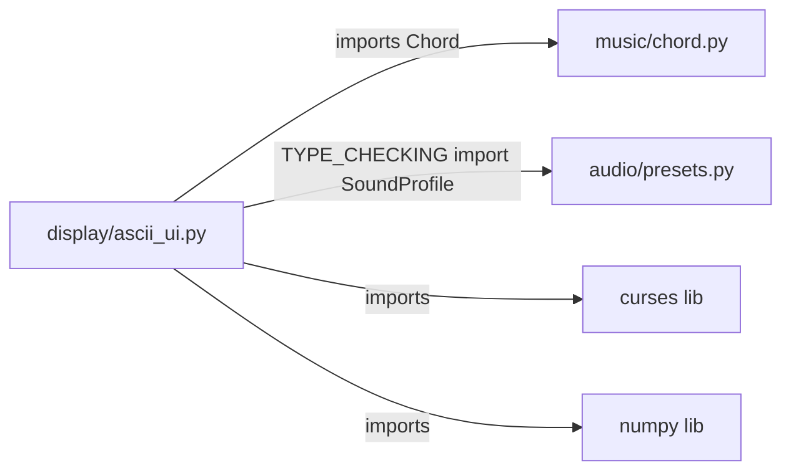

# Module: display

## Status and Ownership

**Status: complete**

**Owns:** `src/omnichord/display/`

## Responsibilities

- Render ASCII terminal UI using curses library
- Display current chords with visual highlighting
- Visualize strum plate state (14 positions)
- Show chord keyboard reference with circle of fifths layout
- Display voice test mode debug panel with parameter controls
- Render real-time amplitude meter
- Optional FFT spectrum visualization (32-bin ASCII graph)
- Handle terminal resize and color support gracefully

## Public Interfaces

### AsciiUI Class
- **`AsciiUI(stdscr)`** - Constructor with curses window
- **`draw(current_chords, active_strum_positions, active_voices, last_strum_notes, sustain_mode)`** - Render normal mode UI
- **`draw_voice_test_panel(test_profile, selected_param_index, active_voices, sample_rate, buffer_size, peak_level, fft_bins, recording_enabled, last_save_path)`** - Render voice test mode UI

### Display Modes
1. **Normal Mode** - Chord reference, strum plate, debug info, status
2. **Voice Test Mode** - ADSR params, oscillator settings, amplitude meter, optional FFT, preset selection

## Internal Architecture

```mermaid
flowchart TB
    subgraph Initialization
        SetupColors[_setup_colors]
        CheckColorSupport{curses.has_colors?}
        InitPairs[Init color pairs 1-4]
    end

    subgraph Normal_Mode_Rendering["Normal Mode"]
        ClearScreen[clear screen]
        DrawTitle[_draw_title: banner]
        DrawChordDisplay[_draw_chord_display: current chords]
        DrawStrumPlate[_draw_strum_plate: 14 keys]
        DrawDebug[_draw_debug: last notes]
        DrawChordRef[_draw_chord_reference: keyboard layout]
        DrawStatus[_draw_status: voices, sustain]
        DrawHelp[_draw_help: controls]
        Refresh[refresh]
    end

    subgraph Voice_Test_Mode_Rendering["Voice Test Mode"]
        ClearScreen2[clear screen]
        DrawVoiceTitle[_draw_voice_test_title]
        DrawADSRParams[_draw_adsr_params: 4 params with selection]
        DrawOscParams[_draw_oscillator_params: sine_mix, waveform]
        DrawEngineInfo[_draw_engine_info: voices, sample rate, buffer]
        DrawAmpMeter[_draw_amplitude_meter: 40-char meter]
        DrawFFT{FFT enabled?}
        DrawFFTSpectrum[_draw_fft_spectrum: 32x8 ASCII graph]
        DrawPresets[_draw_preset_selection: F1-F6]
        DrawSaveStatus{Save path?}
        DrawSave[_draw_save_status]
        DrawVoiceHelp[_draw_voice_test_help]
        Refresh2[refresh]
    end

    SetupColors --> CheckColorSupport
    CheckColorSupport -->|Yes| InitPairs

    ClearScreen --> DrawTitle
    DrawTitle --> DrawChordDisplay
    DrawChordDisplay --> DrawStrumPlate
    DrawStrumPlate --> DrawDebug
    DrawDebug --> DrawChordRef
    DrawChordRef --> DrawStatus
    DrawStatus --> DrawHelp
    DrawHelp --> Refresh

    ClearScreen2 --> DrawVoiceTitle
    DrawVoiceTitle --> DrawADSRParams
    DrawADSRParams --> DrawOscParams
    DrawOscParams --> DrawEngineInfo
    DrawEngineInfo --> DrawAmpMeter
    DrawAmpMeter --> DrawFFT
    DrawFFT -->|Yes| DrawFFTSpectrum
    DrawFFT -->|No| DrawPresets
    DrawFFTSpectrum --> DrawPresets
    DrawPresets --> DrawSaveStatus
    DrawSaveStatus -->|Yes| DrawSave
    DrawSaveStatus -->|No| DrawVoiceHelp
    DrawSave --> DrawVoiceHelp
    DrawVoiceHelp --> Refresh2
```



## Dependencies



## Key Flows

### Normal Mode Rendering Flow
1. **Clear screen** - `stdscr.clear()`
2. **Draw title banner** - Centered "OMNICHORD EMULATOR" with box
3. **Draw chord display** - Current chords highlighted in yellow
4. **Draw strum plate** - 14 keys, active ones highlighted in cyan
5. **Draw debug info** - Last triggered note names in green
6. **Draw chord reference** - 3 rows (Major/Minor/7th) × 10 columns, highlight active
7. **Draw status** - Voice count, sustain mode
8. **Draw help** - Control hints
9. **Refresh** - `stdscr.refresh()`

**Evidence:** `display/ascii_ui.py:48-88`

### Voice Test Mode Rendering Flow
1. **Clear screen**
2. **Draw title** - "VOICE TEST MODE"
3. **Draw ADSR params** - 4 params with ">" indicator on selected
4. **Draw oscillator params** - Sine mix + waveform with selection
5. **Draw engine info** - Voices, sample rate, buffer, recording status
6. **Draw amplitude meter** - 40-char bar graph, color by level
7. **Draw FFT** (if enabled) - 32-column × 8-row spectrum
8. **Draw preset selection** - F1-F6 mapping
9. **Draw save status** (if recent) - Saved file path
10. **Draw help** - Control hints
11. **Refresh**

**Evidence:** `display/ascii_ui.py:215-276`

### Color Pair Initialization
If terminal supports colors:
- **Pair 1:** Black on Cyan (active chord/strum highlight)
- **Pair 2:** Cyan on default (title text)
- **Pair 3:** Yellow on default (chord display, high amplitude)
- **Pair 4:** Green on default (debug info, normal amplitude)

If no color support, falls back to attributes (A_BOLD, A_DIM)

**Evidence:** `display/ascii_ui.py:34-46`

### Amplitude Meter Rendering
1. **Calculate filled width** - `min(int(peak * 40), 40)`
2. **Build meter string** - `"[" + "#" * filled + "-" * (40 - filled) + "]"`
3. **Color by level** - Yellow if peak > 0.8, green otherwise
4. **Append numeric value** - ` {peak:.2f}`

**Evidence:** `display/ascii_ui.py:350-368`

### FFT Spectrum Rendering
1. **32 frequency bins** (from AudioEngine)
2. **8 rows tall** - Top row = highest energy threshold
3. **For each row** - Calculate threshold: `1.0 - ((y + 1) / 8)`
4. **For each bin** - Draw "#" if `val >= threshold`, else " "
5. **Color top 3 rows** yellow (high energy), bottom rows green

**Evidence:** `display/ascii_ui.py:399-418`

### Chord Reference Layout
**Circle of fifths order:**
```
     Ab  Eb  Bb  F   C   G   D   A   E   B
M:   Q   W   E   R   T   Y   U   I   O   P
m:   A   S   D   F   G   H   J   K   L   ;
7:   Z   X   C   V   B   N   M   ,   .   /
```

**Rendering:**
- Check if each chord is active via `_is_chord_active(chords, root, quality)`
- Highlight active chords with color pair 1 (cyan background)
- Render inactive chords with normal spacing

**Evidence:** `display/ascii_ui.py:150-196`

## Code References

| Component/Stage | File | Key Symbols (fn/class) | Notes |
|---|---|---|---|
| UI class | `display/ascii_ui.py:16-426` | `AsciiUI` class | Main UI manager |
| Initialization | `display/ascii_ui.py:25-46` | `__init__(stdscr)`, `_setup_colors()` | Color pair setup |
| Normal mode | `display/ascii_ui.py:48-88` | `draw(...)` | Main UI render |
| Title banner | `display/ascii_ui.py:90-100` | `_draw_title()` | Box with centered text |
| Chord display | `display/ascii_ui.py:102-114` | `_draw_chord_display(chords, row)` | Current chords in yellow |
| Strum plate | `display/ascii_ui.py:116-132` | `_draw_strum_plate(active_positions, row)` | 14 keys, highlight active |
| Debug info | `display/ascii_ui.py:134-144` | `_draw_debug(last_notes, row)` | Note names in green |
| Chord reference | `display/ascii_ui.py:150-196` | `_draw_chord_reference(chords, row)` | 3×10 keyboard layout |
| Active check | `display/ascii_ui.py:146-148` | `_is_chord_active(chords, root, quality)` | Helper for highlighting |
| Status bar | `display/ascii_ui.py:198-204` | `_draw_status(active_voices, sustain_mode, row)` | Voice count, mode |
| Help text | `display/ascii_ui.py:206-211` | `_draw_help(row)` | Control hints |
| Voice test panel | `display/ascii_ui.py:215-276` | `draw_voice_test_panel(...)` | Debug mode UI |
| Voice test title | `display/ascii_ui.py:278-287` | `_draw_voice_test_title()` | Banner |
| ADSR params | `display/ascii_ui.py:289-308` | `_draw_adsr_params(profile, selected, row)` | 4 params with selection |
| Oscillator params | `display/ascii_ui.py:310-331` | `_draw_oscillator_params(profile, selected, row)` | Sine mix, waveform |
| Engine info | `display/ascii_ui.py:333-348` | `_draw_engine_info(voices, sr, buf, rec, row)` | Audio engine stats |
| Amplitude meter | `display/ascii_ui.py:350-369` | `_draw_amplitude_meter(peak, row)` | 40-char bar graph |
| Preset selection | `display/ascii_ui.py:371-386` | `_draw_preset_selection(row)` | F1-F6 mapping |
| Voice test help | `display/ascii_ui.py:388-397` | `_draw_voice_test_help(recording, row)` | Control hints |
| FFT spectrum | `display/ascii_ui.py:399-418` | `_draw_fft_spectrum(fft_bins, row)` | 32×8 ASCII graph |
| Save status | `display/ascii_ui.py:420-425` | `_draw_save_status(path, row)` | Saved file confirmation |
| Constants | `display/ascii_ui.py:20-23` | `ROOT_NOTES`, `STRUM_LABELS` | Display labels |

## Error Handling

All curses operations are wrapped in `try/except curses.error` blocks. This handles:
- Terminal resize during rendering
- Attempting to write outside screen bounds
- Terminal without color support

**Pattern:**
```python
try:
    self._stdscr.addstr(row, col, text, attr)
except curses.error:
    pass  # Silently ignore rendering errors
```

**Evidence:** Used throughout all `_draw_*` methods

## TODO / Unknowns

- **Terminal resize handling:** Current implementation silently ignores errors. Could detect resize events and re-render with adjusted layout.
- **UTF-8 support:** Uses ASCII characters only. Could enhance with Unicode box-drawing characters for cleaner borders (if terminal supports it).
