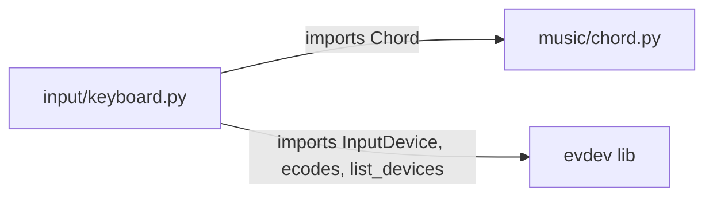

# Module: input

## Status and Ownership

**Status: complete**

**Owns:** `src/omnichord/input/`

## Responsibilities

- Auto-detect and connect to keyboard device via evdev
- Provide N-key rollover (simultaneous key detection)
- Map physical keys to chord buttons (30 chords: 10 roots × 3 qualities)
- Map physical keys to strum plate positions (14 positions)
- Detect newly pressed vs held keys for velocity sweep mechanics
- Handle special keys (ESC, RAlt, RCtrl, arrows, F-keys, R)

## Public Interfaces

### KeyboardHandler Class
- **`__init__(device_path=None)`** - Auto-detects keyboard if no path given
- **`poll() -> bool`** - Non-blocking event reader, returns True if ESC pressed
- **`get_held_chords() -> list[Chord]`** - All currently held chords (polyphonic)
- **`get_pressed_strum_keys() -> set[int]`** - Strum positions 1-14 currently held
- **`get_newly_pressed_strum_keys() -> set[int]`** - Strum positions pressed this frame
- **`is_ralt_newly_pressed() -> bool`** - RAlt toggle detection
- **`is_rctrl_newly_pressed() -> bool`** - RCtrl toggle detection
- **`is_up_newly_pressed() -> bool`** - Up arrow detection
- **`is_down_newly_pressed() -> bool`** - Down arrow detection
- **`is_left_newly_pressed() -> bool`** - Left arrow detection
- **`is_right_newly_pressed() -> bool`** - Right arrow detection
- **`get_newly_pressed_fkey() -> int | None`** - Returns 1-6 if F1-F6 pressed
- **`is_r_newly_pressed() -> bool`** - R key detection
- **`close()`** - Ungrab device

### Keyboard Mappings
**Chord buttons (circle of fifths):**
```
        Ab  Eb  Bb  F   C   G   D   A   E   B
Major:  Q   W   E   R   T   Y   U   I   O   P
Minor:  A   S   D   F   G   H   J   K   L   ;
7th:    Z   X   C   V   B   N   M   ,   .   /
```

**Strum plate (low to high):**
```
`   1   2   3   4   5   6   7   8   9   0   -   =   ⌫
```

**Control keys:**
- ESC: Quit
- RAlt: Toggle sustain mode
- RCtrl: Toggle voice test mode
- Arrows: Navigate/adjust in voice test mode
- F1-F6: Load presets in voice test mode
- R: Save recording in voice test mode

## Internal Architecture

```mermaid
flowchart TB
    subgraph Initialization
        FindDevice[find_keyboard_device]
        AutoDetect{Auto-detect?}
        ScanDevices[Scan /dev/input devices]
        CheckCaps[Check for EV_KEY, KEY_A, KEY_Z]
        GrabDevice[device.grab exclusive access]
    end

    subgraph State_Management
        HeldKeys[_held_keys: set[str]]
        PrevKeys[_prev_held_keys: set[str]]
    end

    subgraph Event_Processing["poll() Event Loop"]
        SavePrev[Copy _held_keys → _prev_held_keys]
        ReadEvents[device.read_one loop]
        ParseEvent{Event type?}
        GetKeyName[ecodes.KEY.get code]
        HandleDown[value=1: add to _held_keys]
        HandleUp[value=0: remove from _held_keys]
        CheckESC{ESC pressed?}
    end

    subgraph Query_Methods
        GetChords[get_held_chords: map keys → Chord]
        GetStrum[get_pressed_strum_keys: map keys → positions]
        GetNewlyPressed[Compare _held_keys vs _prev_held_keys]
    end

    FindDevice --> AutoDetect
    AutoDetect -->|Yes| ScanDevices
    AutoDetect -->|No| GrabDevice
    ScanDevices --> CheckCaps
    CheckCaps --> GrabDevice
    GrabDevice --> SavePrev
    SavePrev --> ReadEvents
    ReadEvents --> ParseEvent
    ParseEvent -->|EV_KEY| GetKeyName
    GetKeyName --> HandleDown
    GetKeyName --> HandleUp
    HandleDown --> CheckESC
    HandleUp --> CheckESC
    CheckESC -->|continue| ReadEvents
    CheckESC -->|done| GetChords
    GetChords --> GetStrum
    GetStrum --> GetNewlyPressed
```

## Dependencies



## Key Flows

### Device Auto-Detection Flow
1. **List all input devices** - `list_devices()` returns paths
2. **Check each device** - Get capabilities via `device.capabilities()`
3. **Filter for keyboards** - Must have `EV_KEY`, `KEY_A`, `KEY_Z` in capabilities
4. **Return first match** - Or raise RuntimeError if none found

**Evidence:** `input/keyboard.py:77-106`

### Event Processing Flow (poll)
1. **Save previous state** - `_prev_held_keys = _held_keys.copy()`
2. **Read all pending events** - `device.read_one()` in loop until None
3. **Parse key events** - Filter for `EV_KEY` type, ignore repeats (value=2)
4. **Update held keys** - Add on press (value=1), remove on release (value=0)
5. **Check quit** - Return True if ESC pressed

**Evidence:** `input/keyboard.py:131-172`

### Chord Detection Flow
1. **Iterate held keys** - Check each key in `_held_keys`
2. **Lookup in CHORD_MAP** - Map key name to (root, quality) tuple
3. **Create Chord objects** - `Chord(root=root, quality=quality)`
4. **Return list** - Supports polyphonic layering (multiple chords)

**Evidence:** `input/keyboard.py:174-187`

### Newly Pressed Detection Pattern
Used for velocity sweep, toggle detection:
1. **Compare sets** - `newly_pressed = _held_keys - _prev_held_keys`
2. **Filter by key type** - Check if keys are in relevant map (e.g., STRUM_KEYS)
3. **Return relevant subset** - Positions, boolean, or F-key number

**Evidence:** `input/keyboard.py:201-214` (strum), `input/keyboard.py:216-227` (RAlt)

## Code References

| Component/Stage | File | Key Symbols (fn/class) | Notes |
|---|---|---|---|
| Device finder | `input/keyboard.py:77-106` | `find_keyboard_device(device_path)` | Auto-detect or explicit path |
| Keyboard handler | `input/keyboard.py:109-315` | `KeyboardHandler` class | Main input manager |
| Initialization | `input/keyboard.py:116-123` | `__init__(device_path)` | Finds device, grabs exclusive |
| Event polling | `input/keyboard.py:131-172` | `poll() -> bool` | Non-blocking, returns quit flag |
| Chord detection | `input/keyboard.py:174-187` | `get_held_chords() -> list[Chord]` | Maps keys to chords |
| Strum detection | `input/keyboard.py:189-214` | `get_pressed_strum_keys()`, `get_newly_pressed_strum_keys()` | Current + delta detection |
| Toggle detection | `input/keyboard.py:216-240` | `is_ralt_newly_pressed()`, `is_rctrl_newly_pressed()` | Frame-delta detection |
| Arrow detection | `input/keyboard.py:242-268` | `is_up_newly_pressed()`, etc. | Voice test navigation |
| F-key detection | `input/keyboard.py:270-286` | `get_newly_pressed_fkey() -> int \| None` | Preset loading (1-6) |
| R key detection | `input/keyboard.py:288-296` | `is_r_newly_pressed()` | Recording save trigger |
| Chord mapping | `input/keyboard.py:15-56` | `CHORD_MAP` dict | 30 keys → (root, quality) |
| Strum mapping | `input/keyboard.py:59-74` | `STRUM_KEYS` dict | 14 keys → positions 1-14 |

## TODO / Unknowns

None identified.
