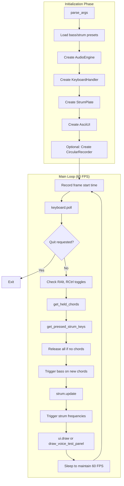
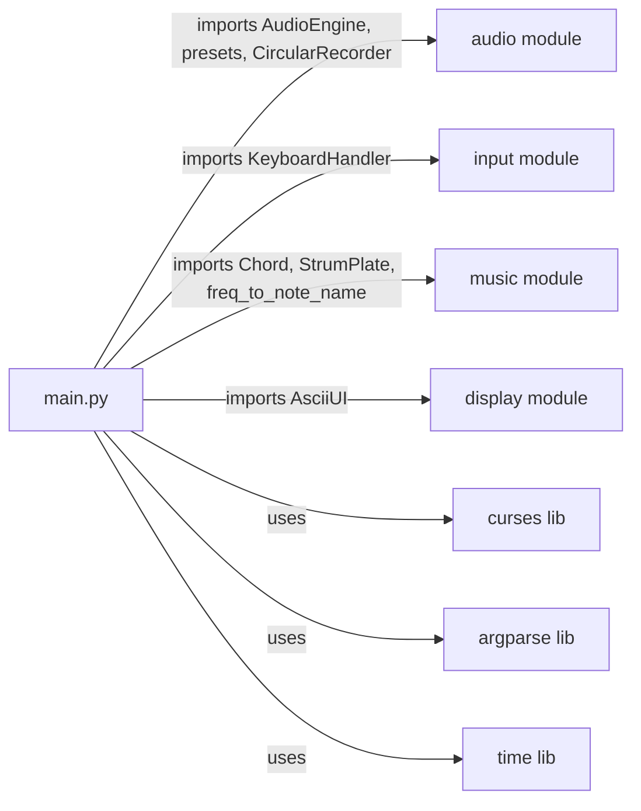

# Module: main

## Status and Ownership

**Status: complete**

**Owns:** `src/omnichord/main.py`

## Responsibilities

- Parse CLI arguments (presets, octaves, sample rate, buffer size, recording)
- Initialize all subsystems (audio engine, keyboard, strum plate, UI)
- Run 60 FPS game loop orchestrating input, logic, and display
- Manage application state (sustain mode, voice test mode, recording)
- Handle frame timing and graceful shutdown

## Public Interfaces

### CLI Entrypoint
- **`main()`** - Entry point installed as console script `omnichord`
- **`parse_args()`** - Returns argparse.Namespace with CLI options

### Command-line Options
```bash
--bass-octave INT          # Bass chord octave (default: 3)
--strum-low INT            # Lowest strum octave (default: 2)
--strum-high INT           # Highest strum octave (default: 6)
--bass-preset PRESET       # warm-pad|plucky-bass|classic (default: classic)
--strum-preset PRESET      # harp|bright|classic (default: classic)
--sample-rate INT          # Audio sample rate (default: 44100)
--buffer-size INT          # Audio buffer size (default: 512)
--record-buffer SECONDS    # Enable circular recording buffer
--show-fft                 # Enable FFT spectrum display
```

## Internal Architecture



## Dependencies



## Key Flows

### Bass Chord Trigger Flow
1. **Detect newly pressed chords** - Compare current vs previous frame
2. **Get frequencies** - `chord.get_frequencies(octave=bass_octave)` for each new chord
3. **Trigger notes** - `engine.trigger_note(freq, profile=bass_profile)` for each frequency

**Evidence:** `main.py:236-243`

### Strum Plate Flow
1. **Update strum plate** - `strum.update(current_chords, strum_keys)` returns new frequencies
2. **Trigger notes** - For each frequency, call `engine.trigger_note(freq, profile=strum_profile)`

**Evidence:** `main.py:245-256`

### Voice Test Mode Flow
1. **Toggle with RCtrl** - Enters/exits voice test mode
2. **Arrow keys** - Select parameter (Up/Down), adjust value (Left/Right)
3. **F1-F6** - Load preset
4. **R key** - Save recording (if enabled)
5. **Always uses C major** - `frequencies = strum.update([C_MAJOR], strum_keys)`

**Evidence:** `main.py:179-226`, `main.py:246-250`

### Sustain Mode Toggle
1. **RAlt pressed** - Flip `bass_sustain_infinite` flag
2. **Update bass_profile** - Switch between `SUSTAIN_MODE_INFINITE` and `SUSTAIN_MODE_NATURAL`
3. **Effect** - Infinite sustain holds notes indefinitely; natural sustain decays normally

**Evidence:** `main.py:172-177`

## Code References

| Component/Stage | File | Key Symbols (fn/class) | Notes |
|---|---|---|---|
| CLI parsing | `main.py:31-89` | `parse_args()` | argparse with 9 options |
| Main entry | `main.py:295-313` | `main()` | curses.wrapper + error handling |
| Game loop | `main.py:96-293` | `run_omnichord(stdscr)` | 60 FPS loop, context managers |
| Initialization | `main.py:102-141` | Lines 108-141 | Preset loading, component creation |
| Frame timing | `main.py:159-161, 289-292` | Lines 159-161, 289-292 | Target 60 FPS with sleep |
| Input polling | `main.py:168-178` | Lines 168-178 | keyboard.poll, sustain toggle |
| Voice test mode | `main.py:179-226` | Lines 179-226 | Parameter adjustment, preset loading |
| Chord handling | `main.py:232-243` | Lines 232-243 | Chord detection, bass trigger |
| Strum handling | `main.py:245-261` | Lines 245-261 | Strum update, note trigger |
| UI rendering | `main.py:264-287` | Lines 264-287 | Conditional: normal or voice test UI |

## TODO / Unknowns

None identified.
