# Module: music

## Status and Ownership

**Status: complete**

**Owns:** `src/omnichord/music/`

## Responsibilities

- Define chord intervals (major, minor, dominant 7th)
- Convert between note names, MIDI numbers, and frequencies
- Calculate chord frequencies for given octaves
- Map strum plate positions to frequencies (arpeggio-like spread)
- Track strum velocity sweep state (detect newly pressed keys)
- Provide debug info for strum plate operation

## Public Interfaces

### Chord Class
- **`Chord(root: str, quality: str)`** - Constructor with note name and quality
- **`get_frequencies(octave: int) -> list[float]`** - Frequencies for bass chords
- **`get_strum_frequencies(position, num_positions, octave_low, octave_high) -> list[float]`** - Frequency for strum position
- **`display_name`** property - Human-readable name (e.g., "Cm", "C7")
- **`intervals`** property - Semitone intervals for quality

### StrumPlate Class
- **`StrumPlate(octave_low=2, octave_high=6)`** - Constructor with octave range
- **`update(chords: list[Chord], pressed_keys: set[int]) -> list[float]`** - Returns frequencies for newly pressed keys
- **`get_frequencies_for_position(chord, position) -> list[float]`** - Direct position lookup
- **`debug_info`** property - Debug string showing raw/sorted key detection

### Notes Module
- **`note_to_midi(note: str, octave: int) -> int`** - Note name to MIDI number
- **`midi_to_freq(midi: int) -> float`** - MIDI number to Hz (A4 = 440Hz)
- **`freq_to_note_name(freq: float) -> str`** - Hz to nearest note name

### Constants
- **`CHORD_INTERVALS`** - Dict mapping quality to semitone lists
  - "major": [0, 4, 7]
  - "minor": [0, 3, 7]
  - "7th": [0, 4, 7, 10]

## Internal Architecture

```mermaid
flowchart TB
    subgraph Chord_Calculation["Chord Frequency Calculation"]
        ChordInput[Chord: root + quality]
        GetIntervals[Look up intervals]
        RootMIDI[note_to_midi root + octave]
        AddIntervals[Add each interval to root MIDI]
        ConvertFreq[midi_to_freq for each]
        OutputFreqs[List of frequencies]
    end

    subgraph Strum_Position_Mapping["Strum Position → Frequency"]
        Position[Position 1-14]
        CalcCycle[cycle = position - 1 // num_notes]
        CalcIndex[note_index = position - 1 % num_notes]
        CalcOctave[octave = min octave_low + cycle, octave_high]
        GetNote[chord_notes = intervals]
        SelectNote[intervals note_index]
        RootMIDI2[note_to_midi root + octave]
        AddInterval[Add interval to root MIDI]
        ConvertFreq2[midi_to_freq]
    end

    subgraph Strum_Velocity_Sweep["Velocity Sweep Detection"]
        PressedKeys[pressed_keys: set]
        PrevKeys[_prev_keys: set]
        NewlyPressed[newly_pressed = pressed - prev]
        SortKeys[sorted newly_pressed]
        GetFreqs[For each: get_frequencies_for_position]
        OutputSweep[Frequencies for sweep]
    end

    ChordInput --> GetIntervals
    GetIntervals --> RootMIDI
    RootMIDI --> AddIntervals
    AddIntervals --> ConvertFreq
    ConvertFreq --> OutputFreqs

    Position --> CalcCycle
    CalcCycle --> CalcIndex
    CalcIndex --> CalcOctave
    CalcOctave --> GetNote
    GetNote --> SelectNote
    SelectNote --> RootMIDI2
    RootMIDI2 --> AddInterval
    AddInterval --> ConvertFreq2

    PressedKeys --> NewlyPressed
    PrevKeys --> NewlyPressed
    NewlyPressed --> SortKeys
    SortKeys --> GetFreqs
    GetFreqs --> OutputSweep
```

## Dependencies

## Key Flows

### Bass Chord Frequency Calculation
1. **Get MIDI root** - `note_to_midi(root, octave)` (e.g., "C", 3 → 48)
2. **Add intervals** - For each interval in quality, add to root MIDI
3. **Convert to Hz** - `midi_to_freq(midi)` for each note
4. **Return list** - E.g., C major = [130.81, 164.81, 196.00] Hz

**Evidence:** `music/chord.py:53-62`

### Strum Position Mapping Algorithm
Given position 1-14, octave range 2-6, and a 3-note chord:
1. **Calculate cycle** - `(position - 1) // 3` (how many full chord cycles)
2. **Calculate note index** - `(position - 1) % 3` (which note in chord)
3. **Calculate octave** - `min(octave_low + cycle, octave_high)` (cap at high)
4. **Get MIDI** - `note_to_midi(root, octave) + intervals[note_index]`
5. **Convert to Hz** - Return single frequency

**Example:** C major, position 5 → cycle=1, index=1 → octave=3, note=E → E3 = 164.81 Hz

**Evidence:** `music/chord.py:64-102`

### Velocity Sweep Detection
1. **Compare key sets** - `newly_pressed = pressed_keys - _prev_keys`
2. **Sort positions** - `sorted(newly_pressed)` for ascending order
3. **Get frequencies** - For each position and each held chord, call `get_frequencies_for_position`
4. **Extend list** - Accumulate all frequencies from all chords
5. **Update state** - `_prev_keys = pressed_keys.copy()`

**Evidence:** `music/strum.py:43-90`

### Note Name Conversion
**MIDI → Frequency:**
- Formula: `440 * 2^((midi - 69) / 12)` (A4 = MIDI 69 = 440 Hz)

**Note Name → MIDI:**
- Base note ("C", "C#", "D", ...) → 0-11
- Octave offset: `(octave + 1) * 12`
- Sum: `base + octave_offset`

**Frequency → Note Name:**
- Reverse: `69 + 12 * log2(freq / 440)`
- Round to nearest MIDI, convert to note name

**Evidence:** `music/notes.py:1-64`

## Code References

| Component/Stage | File | Key Symbols (fn/class) | Notes |
|---|---|---|---|
| Chord class | `music/chord.py:15-109` | `Chord` dataclass | Root + quality, immutable |
| Chord intervals | `music/chord.py:8-12` | `CHORD_INTERVALS` dict | 3 qualities defined |
| Bass frequencies | `music/chord.py:53-62` | `Chord.get_frequencies(octave)` | Simple interval addition |
| Strum frequencies | `music/chord.py:64-102` | `Chord.get_strum_frequencies(...)` | Position → octave + note mapping |
| Strum plate | `music/strum.py:10-121` | `StrumPlate` class | Velocity sweep state machine |
| Sweep detection | `music/strum.py:43-90` | `StrumPlate.update(chords, pressed_keys)` | Set difference + sorting |
| Position lookup | `music/strum.py:92-115` | `get_frequencies_for_position(chord, pos)` | Direct mapping helper |
| Note → MIDI | `music/notes.py:7-26` | `note_to_midi(note, octave)` | Name + octave → MIDI number |
| MIDI → Freq | `music/notes.py:29-42` | `midi_to_freq(midi)` | Equal temperament, A4=440 |
| Freq → Note | `music/notes.py:45-64` | `freq_to_note_name(freq)` | Reverse lookup with rounding |
| Note name map | `music/notes.py:4` | `NOTE_NAMES` list | 12 notes per octave |

## TODO / Unknowns

- **Strum key sorting issue:** Comment at `strum.py:78-82` notes that sorting `newly_pressed` keys may scramble the intended order. The current implementation sorts for ascending pitch, but this may not match the physical key order for simultaneous presses. Consider using insertion order if Python 3.7+ dict ordering is relied upon, or investigate alternative ordering strategies.
