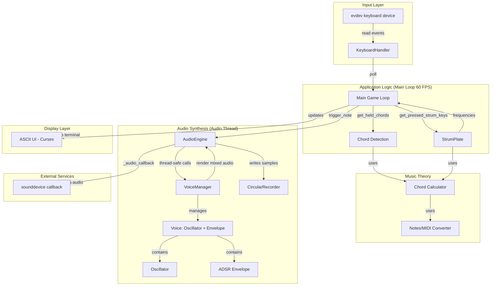
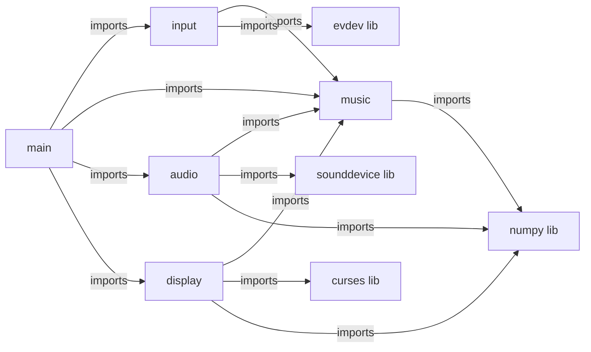

# System Architecture (SACS)

## Scope and Status

**Status: complete**

This SACS covers the Omnichord emulator - a Python-based real-time musical instrument with evdev keyboard input, polyphonic synthesis, and ASCII terminal UI.

**Coverage:**
- All core modules: main, input, music, audio, display
- Threading model (main thread + audio callback thread)
- Data flow from keyboard events to audio output

**Skipped:**
- External dependencies (sounddevice, evdev, curses, numpy) - treated as black boxes

## High-Level Overview

## Module Dependency DAG

## Key Interfaces

### Input → Application
- **KeyboardHandler.poll()** - Non-blocking event reader, returns quit flag
- **KeyboardHandler.get_held_chords()** - Returns list of Chord objects
- **KeyboardHandler.get_pressed_strum_keys()** - Returns set of strum positions (1-14)

### Music → Audio
- **Chord.get_frequencies(octave)** - Returns list of Hz frequencies for bass chords
- **Chord.get_strum_frequencies(position, ...)** - Maps strum position to frequency

### Application → Audio
- **AudioEngine.trigger_note(freq, velocity, profile)** - Thread-safe note trigger
- **AudioEngine.release_all()** - Release all active voices

### Application → Display
- **AsciiUI.draw(current_chords, active_strum_positions, ...)** - Full UI render

### Audio → External
- **AudioEngine._audio_callback(outdata, frames, ...)** - Called by sounddevice in audio thread

## Code References (Top-Level)

| Component/Module | File(s) | Key Functions/Classes | Notes |
|---|---|---|---|
| Main entry | `src/omnichord/main.py:1-314` | `main()`, `run_omnichord()`, `parse_args()` | 60 FPS loop orchestrates all modules |
| Keyboard input | `src/omnichord/input/keyboard.py:1-315` | `KeyboardHandler`, `find_keyboard_device()` | evdev-based N-key rollover |
| Chord detection | `src/omnichord/input/keyboard.py:174-187` | `KeyboardHandler.get_held_chords()` | Maps held keys to Chord objects |
| Strum plate | `src/omnichord/music/strum.py:10-121` | `StrumPlate.update()` | Velocity sweep detection |
| Chord theory | `src/omnichord/music/chord.py:15-109` | `Chord.get_frequencies()`, `Chord.get_strum_frequencies()` | MIDI → Hz conversion |
| Audio engine | `src/omnichord/audio/engine.py:15-215` | `AudioEngine`, `_audio_callback()` | sounddevice integration, threading |
| Voice management | `src/omnichord/audio/voice.py:62-198` | `VoiceManager.allocate_voice()`, `.render()` | 16-voice polyphony, stealing |
| Synthesis | `src/omnichord/audio/voice.py:14-60` | `Voice.render()` | Per-voice oscillator + envelope |
| Oscillator | `src/omnichord/audio/synth.py:89-143` | `Oscillator.generate()` | Sine/saw/blended waveforms |
| Envelope | `src/omnichord/audio/envelope.py:31-149` | `ADSREnvelope.get_amplitude()` | Attack/Decay/Sustain/Release |
| Presets | `src/omnichord/audio/presets.py` | `SoundProfile`, `get_bass_preset()`, `get_strum_preset()` | Named ADSR + waveform configs |
| UI rendering | `src/omnichord/display/ascii_ui.py:16-426` | `AsciiUI.draw()`, `.draw_voice_test_panel()` | Curses-based terminal display |

## Threading Model

The Omnichord uses a **two-thread architecture**:

### Main Thread (60 FPS)
- Polls keyboard input (non-blocking)
- Updates strum plate state
- Triggers audio notes via thread-safe calls
- Renders UI at 60 FPS

**Evidence:** `src/omnichord/main.py:159-292` - main loop with frame timing

### Audio Thread
- Runs in sounddevice callback context (~11ms periods at 44100Hz/512 buffer)
- Renders VoiceManager samples
- Computes FFT if enabled
- Writes to CircularRecorder

**Evidence:** `src/omnichord/audio/engine.py:162-206` - `_audio_callback()` method

### Thread Safety
- **Lock:** `AudioEngine._lock` (threading.Lock) protects VoiceManager access
- **Read operations:** `active_voice_count`, `last_peak` - lock-protected or atomic float
- **Write operations:** `trigger_note()`, `release_all()` - lock-protected

**Evidence:** `src/omnichord/audio/engine.py:45` - lock initialization, `engine.py:97-114` - lock usage

## Data Flow: Key Press to Audio Output

## TODO / Unknowns

None identified - system architecture is fully documented.
